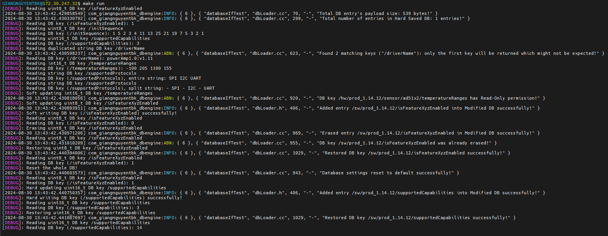
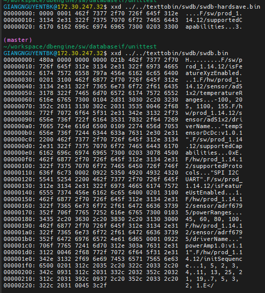

# dbengine
```
This is a binary database which is loaded into RAM at program runtime. 
We will implement a project where we will try to compile text file databases to binary databases.
This binary database will be loaded to program's RAM at startup. There are some way to encrypt binary database for more security.
```

```
1. There are text database files which contain only two things below:
	+ Comment sections: must start with /* and end with */
	+ DB entries: must be formed like this: key	type	value
		- key must be like: /production_type/something/something. Key accepts only one simple wildcard string "x", "x" will be replaced by any numerical number.
		- type: must be like: U8, U32, char,...
		- value: is an array of type

	For example: if key is U8 and value is 10, 11, 12. This means there will be an U8* pointer to an array of U8 data with 3 consecutive elements.
		Delimitter in this case will be considered as ", " for non-char type and as " " for char type.

Type will be mapped to an enum, for example:
enum TypeOfEntry_e {
	TYPE_OF_ENTRY_UNDEFINED	= 0,
	TYPE_OF_ENTRY_U8	= 1,
	...
};

Example: databaseA.txt
/* This is comment sections */
/board_1.12.1/temperatureLevels		U8	-10, 30, 80, 150
/board_1.41.x/initPatterns		CHAR	"L P F"		/* This means all boards for 1.41.x generation such as 1.41.1 or 1.41.12,... will be applied for this key */

2. Next step, will we write an script, python or maybe C program to concatenate all text database files into one file probably named swdb.bin.txt.
The program/script will remove all comments in text database files as well.

Example: swdb.bin.text
/* Comment is ignored during scanning byte stream (all bytes in between /* and */ are discarded). */
/* Because all floating point value should be re-scaled into intergers, MUST write down the resolution and unit for every database record for better understanding */
/* Data types are only S32, U32, S16, U16, S8, U8, CHAR. Value of each record is treated as a vector of the respective type with at least 1 element. Delimiter is described in details as below. */
/hw/board_1.12.1/temperatureLevels         		R	S32	-10, 30, 80, 150
/hw/board_1.12.1/toleranceLevels         		R	S16	-10, 30, 80, 150 /* Numeric delimiter is ", " */
/sw/board_1.41.x/initPatterns              		RW	CHAR	"L P F" /* String delimiter is spaces " " */
/sw/board_1.23.5/compensatePeriod			RW	U32     0x0FFEC /* We can use hex number for bits/registers/hex related things */
/sw/board_1.11.x/moduleABC/isFeatureAbcEnabled       	RW	U8    	1

3, Next, we will write a helper program which will convert swapp.bin.text file to swapp.bin binary database file. The binary file will look like below.
Example: swdb.bin
5402 0000 0000 0000 0100 aaaa aaaa aaaa		T. .. .. .. .. 

+ H = header, must be the first byte of swdb.bin
+ The second byte is databaseRevision dbRev
+ The next 4 bytes are reserved additional parameters for dbRev
+ The next 4 bytes are the number bytes of actual database payload, length of the entire payload
+ The next are consecutive dbEntries with format: F<key>'\0'<permission><type><value>'\0'
	- F is the start signature of each dbEntry.
	- <key> is the string "key" as above, note that it includes string termination character '\0' as well.
	- <permission> is 1 byte to indicate "permission" for each entry (0 -> Read only,, 1 -> Read Write).
	- <type> is 1 byte to indicate TypeOfEntry_e.
	- <value> is the string of "value", note that it includes string null termination "\0" as well. For example, for numeric types "value" will be a string of "5, 10, 15, 20" while for char type "value" will be a string of ""L P F"" (be careful about two additional double-quote characters)
+ After all dbEntries, that means end of payload, there must be an byte 'E' indicate end of payload.
+ There are some padding bytes with zero value before the last 4 bytes for CRC checksum.

4. Step by step:

+ texttobin: 
	- Convert text-based database files into binary files in a specific form (for example, header bytes, delimiter for each pair key-type-value and also between those three things, end of file bytes,...).
	- (Optional) Encrypt binary files with libssl-dev accoording to RSA or AES mechanisms.

+ dbloader:
	- (Optional) Read encrypted binary database files, decrypt it.
	- Save all pairs of key-value into a hash table, so lookup time will be O(1) ("type" in the key-type-value pair is used to obtain a correct type of the "value").

+ databaseif:
	- Define database interfaces (maybe template class or visitor,...) to get value of a given matching key.

5. TODO
+ Apply binary encryption using RSA, AES,...
+ Add one more field (maybe 1 byte) after DB Revision, to check if it's encrypted or not.

```



